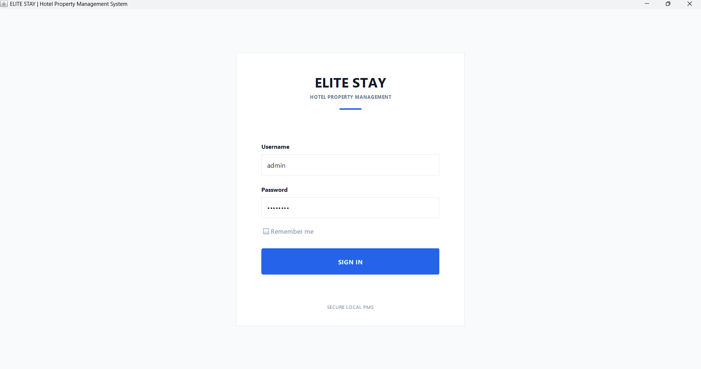
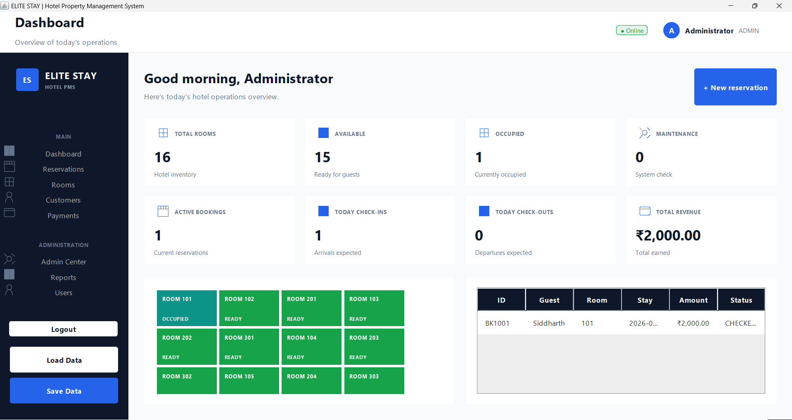
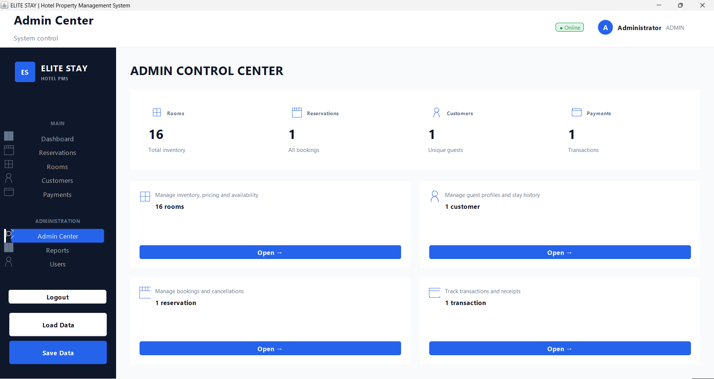

# 🏨 ELITE STAY | Hotel Property Management System

A professional **Java Swing desktop application** for managing hotel rooms, guests, reservations, payments, availability, and administrative operations.

---

## 📸 Application Screenshots

### 🔐 Login



### 📊 Dashboard



### 🛡️ Admin Center



---

## 📌 Project Overview

**ELITE STAY** is a desktop-based Hotel Property Management System built using **Java Swing** and **Object-Oriented Programming principles**.

The application provides a centralized interface for hotel staff to:

- 🏨 Manage hotel room inventory
- 🔎 Search and filter rooms
- 📅 Create and manage reservations
- 👤 Manage guest information
- 💳 Process simulated payments
- 🚪 Manage check-in and check-out
- 🟢 Track room availability
- 🧾 View booking and payment details
- 📊 Monitor hotel operations through a dashboard
- 🛡️ Access administrative controls and reports
- 💾 Save and load application data using Java Serialization

The system is designed as a **local Hotel Property Management System (PMS)** without requiring an external database.

---


# ✨ Key Features

## 🏨 Room Management

- Standard, Deluxe, and Suite room categories
- Room pricing and guest capacity
- Room inventory management
- Availability tracking
- Category-based room filtering
- Date-based availability checking
- Prevention of overlapping bookings
- Room status monitoring

---

## 📅 Reservation Management

- Create new reservations
- Generate unique booking IDs
- Guest details collection
- Check-in and check-out dates
- Guest capacity validation
- Automatic total calculation
- Reservation status tracking
- Reservation cancellation
- Guest check-in
- Guest check-out
- Detailed booking view
- Reservation history

---

## 👤 Guest Management

The system maintains guest information including:

- Guest ID
- Guest name
- Phone number
- Email address
- Reservation history

Guest information is connected with the reservation workflow.

---

## 💳 Payment Management

The application includes a simulated hotel payment system.

Features include:

- Payment processing
- Transaction ID generation
- Multiple payment methods
- Paid and pending payment states
- Payment history
- Payment information linked to reservations
- Receipt / booking confirmation support

### Payment Workflow

```text
Create Reservation
        ↓
Payment
   ┌────┴────┐
   ↓         ↓
Pay Now   Pay Later
   ↓         ↓
PAID      PENDING
   │         │
   └────┬────┘
        ↓
Booking Details
```
## 🔐 Login Credentials

The application includes role-based login for different hotel staff:

| Role | Username | Password |
|---|---|---|
| **Administrator** | `admin` | `admin123` |
| **Hotel Manager** | `manager` | `manager123` |
| **Front Desk Staff** | `receptionist` | `reception123` |

> **Note:** These are the default demo credentials for the local application.

### 👨‍💻Author

Sandesh
Developed as part of the CodeAlpha Java Programming Internship .
